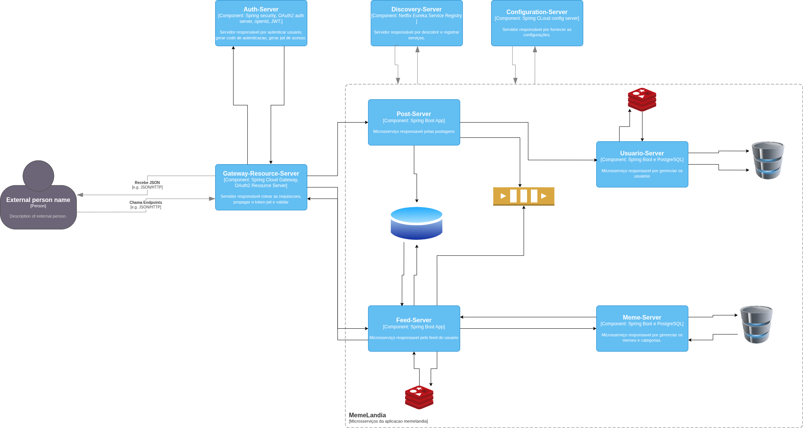

# MEMELÂNDIA
### Projeto final do curso Especialista Back-End Java

Este projeto tem como objetivo desmembrar uma aplicação monolítica em microsserviços mantendo as mesmas funcionalidades e acrescentando a funcionalidade Meme do dia. 

## Objetivos
- Identificar os domínios presentes na aplicação.
- Criar os serviços necessários as operações de cada domínio, seguindo quando possível, os 12 fatores.
- Melhorar a observabilidade nos novos serviços, Logs, Métricas, etc.

## Requisitos Não-funcionais
- Os endpoints deverão ter logs úteis.
- Todos os serviços deverão gerar pelo menos métricas de acesso aos endpoints.

## Requisitos Funcionais
- O cadastro de usuários deverá conter, nome, email e data de cadastro.
- O cadastro de categorias deverá conter, nome, descricao e data de cadastro.
- A publicação do meme deverá conter, nome, url, categoria, usuario e data de cadastro.

## Tecnologias

- Linguagem: Java 17
- Framework: Spring Boot, Spring Security, Spring Authentication Server, Spring Gateway, Spring Cloud.
- Banco de Dados: PostgreSQL, MongoDB, Redis.
- Mensageria: RabbitMQ
- Comunicação entre os microsserviços: OpenFeign
- Ferramentas/ORMs: JPA/Hibernate.
- Infraestrutura: Docker, Docker Compose, Zipkin.
- Documentação: Swagger/OpenAPI, Postman.

## Aquitetura do projeto

 Para este projeto estou utlizando o padrão arquitetural CQRS que é um padrão que separa as responsabilidade de leitura e escrita em modelos distintos. Com isto há um ganho de performance e otimização da escalabilidade horizontal. 

 No caso deste projeto este padrão foi adaptado para que as postagens sejam executadas pelo microsserviço Post (post-server) enquanto que a leitura executada está sob a responsabilidade do microsserviço de Feed (feed-server).

### Desenho da Arquitetura

#### Domínios
- usuario-server - Domínio de usuários
- meme-server - Domínio de memes/categorias
- post-server - Entrada de dados
- feed-server - Leitura de dados
- gateway-server - Orquestração

## Como executar o projeto

- Clone o projeto: git clone https://github.com/marcellojoaquim/memelandia.git
- Entrar o diretório do projeto: cd memelandia
- Para subir os containers da infra: PostgreSQL, MongoDB, Redis, RabbitMQ, Zipkin
- Excute o comando: docker compose up -d
- Subir o servidor de configuração: cd config-server execute o comando ./mvnw spring-boot:run
- Subir os demais serviços da aplicação: a ordem aqui não importa, mas recomendo subir o serviço discovery

### Autenticacao/Autorizacao

Neste projeto estou usando OAuth2 e OpenID, para autenticar-se e gerar o access-token é preciso gerar o code

- Acesse a url que está na raiz do projeto ./utils/url-gera-token.txt.
- Na tela de login: usuario: user, senha: password
- Copie o code retornado na url e adicione na collection do postman e faça a requisição, deve retornar status-code 200 e o access-token.
- Utilize este access-token para as demais requisições.

### Acesso a métricas, tracing e fila

 Acessar as métricas da aplicação e tracing distribuído

- Zipkin: http://localhost:9411/zipkin/

 Acessar a fila do RabbitMQ

- RabbitMQ: http://localhost:15672/
- Username: guest, Password: guest

## Referência bibligráfica/docs

- Spring-boot: https://spring.io/projects/spring-boot
- Spring Auth Server: https://spring.io/projects/spring-authorization-server
- Spring Security: https://spring.io/projects/spring-security
- Spring Cloud: https://spring.io/projects/spring-cloud-config
- Spring Gateway: https://spring.io/projects/spring-cloud-gateway
- Spring OpenFeign: https://spring.io/projects/spring-cloud-openfeign
- Spring Amqp: https://spring.io/projects/spring-amqp
- Spring Redis: https://spring.io/projects/spring-data-redis
- Spring Mongo: https://spring.io/projects/spring-data-mongodb
- Spring Data JPA: https://spring.io/projects/spring-data-jpa
- Zipkin: https://zipkin.io/
