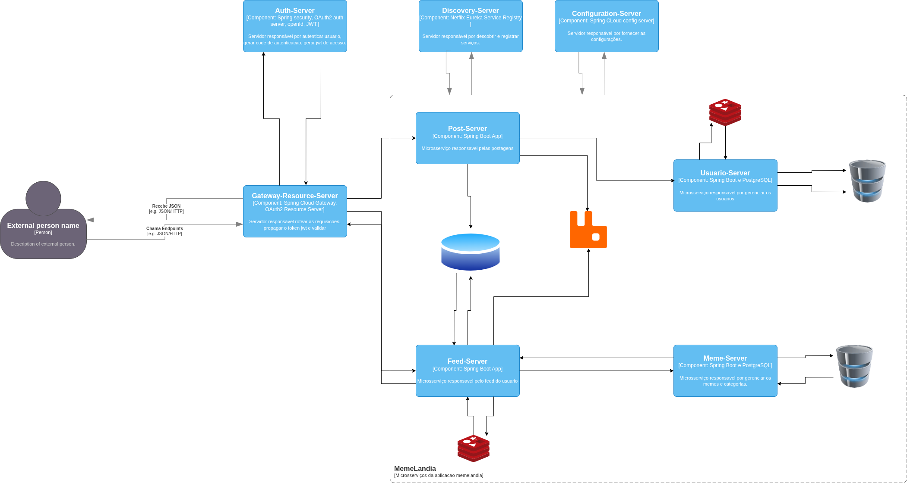

# MEMELÂNDIA
### Projeto final do curso Especialista Back-End Java

Este projeto tem como objetivo desmembrar uma aplicação monolítica em microsserviços mantendo as mesmas funcionalidades e acrescentando a funcionalidade Meme do dia. 

## Objetivos

- Identificar os domínios presentes na aplicação.
- Criar os serviços necessários as operações de cada domínio, seguindo quando possível, os 12 fatores.
- Melhorar a observabilidade nos novos serviços, Logs, Métricas, etc.

## Requisitos Não-funcionais

- Os endpoints deverão ter logs úteis.
- Todos os serviços deverão gerar pelo menos métricas de acesso aos endpoints.

## Requisitos Funcionais

- O cadastro de usuários deverá conter, nome, email e data de cadastro.
- O cadastro de categorias deverá conter, nome, descricao e data de cadastro.
- A publicação do meme deverá conter, nome, url, categoria, usuario e data de cadastro.

## Tecnologias

- Linguagem: Java 17
- Framework: Spring Boot, Spring Security, Spring Authentication Server, Spring Gateway, Spring Cloud.
- Banco de Dados: PostgreSQL, MongoDB, Redis.
- Mensageria: RabbitMQ
- Comunicação entre os microsserviços: OpenFeign
- Ferramentas/ORMs: JPA/Hibernate.
- Infraestrutura: Docker, Docker Compose, Zipkin.
- Documentação: Swagger/OpenAPI, Postman.

## Arquitetura do projeto

 Para este projeto estou utilizando o padrão arquitetural CQRS que é um padrão que separa as responsabilidade de leitura e escrita em modelos distintos. Com isto há um ganho de performance e otimização da escalabilidade horizontal. 

 No caso deste projeto este padrão foi adaptado para que as postagens sejam executadas pelo microsserviço Post (post-server) enquanto que a leitura executada está sob a responsabilidade do microsserviço de Feed (feed-server).

## Decisões Arquiteturais

### Separação entre escrita e leitura (CQRS)

A escrita de dados ocorre no `post-server`, enquanto a leitura é realizada pelo `feed-server`.

Essa decisão foi tomada para:
- Reduzir acoplamento entre operações de leitura e escrita
- Permitir otimização independente de leitura (MongoDB)
- Melhorar escalabilidade horizontal para consultas

Trade-off:
- Consistência eventual entre os dados

### Estratégia de Persistência

Os dados de memes são armazenados em dois contextos:

- `meme-server` → modelo relacional (PostgreSQL)
- `feed-server` → modelo desnormalizado (MongoDB)

Essa abordagem segue o princípio de **materialized view** e **read optimization**.

Benefícios:
- Consultas rápidas no feed
- Redução de joins
- Independência entre leitura e escrita

Trade-off:
- Consistência eventual
- Complexidade de sincronização via mensageria

### Desenho da Arquitetura

### Fluxo de criação de um meme

1. Cliente envia requisição via Gateway
2. Token JWT é validado
3. `post-server` valida usuário
4. Meme é publicado na fila (RabbitMQ)
5. `feed-server` consome a mensagem
6. Dados são persistidos no MongoDB e enviado para o `meme-server`
7. Endpoint de leitura já retorna o novo meme

#### Domínios

- usuario-server - Domínio de usuários
- meme-server - Domínio de memes/categorias
- post-server - Entrada de dados
- feed-server - Leitura de dados
- gateway-server - Orquestração

### Trade-offs

- Uso de múltiplos bancos aumenta complexidade operacional
- Consistência eventual pode causar dados temporariamente desatualizados
- Mensageria adiciona latência na propagação

## Como executar o projeto

### Pré-requisitos
- Java 17
- Docker
- Maven

### Subindo infraestrutura
docker compose up -d

### Subindo serviços
1. config-server
2. discovery-server
3. demais serviços

### Acessos
- Gateway: http://localhost:8081
- Zipkin: http://localhost:9411
- RabbitMQ: http://localhost:15672

### Autenticacao/Autorizacao

Neste projeto estou usando OAuth2 e OpenID, para autenticar-se e gerar o access-token é preciso gerar o code

- Acesse a url que está na raiz do projeto ./utils/url-gera-token.txt.
- Na tela de login: usuario: user, senha: password
- Copie o code retornado na url e adicione na collection do postman e faça a requisição, deve retornar status-code 200 e o access-token.
- Utilize este access-token para as demais requisições.

## Testes

- Testes unitários com JUnit e Mockito
- Testes de integração com Spring Boot Test
- Validação de endpoints com MockMvc

### Acesso a métricas, tracing e fila

 Acessar as métricas da aplicação e tracing distribuído

- Zipkin: http://localhost:9411/zipkin/

 Acessar a fila do RabbitMQ

- RabbitMQ: http://localhost:15672/
- Username: guest, Password: guest

## Observabilidade

O sistema possui tracing distribuído utilizando Zipkin.

Cada requisição é rastreada entre:
- Gateway
- post-server
- feed-server
- meme-server
- usuario-server

Isso permite:
- Identificar gargalos
- Analisar latência entre serviços
- Debug de falhas em ambiente distribuído

## Desafios enfrentados

- Integração entre microsserviços com autenticação OAuth2
- Propagação de JWT via OpenFeign
- Problemas de serialização entre serviços via RabbitMQ
- Problemas de serialização entre serviços e dados retornados pelo Redis
- Garantia de consistência eventual entre bancos distintos
- Configuração de tracing distribuído

## Referência bibligráfica/docs

- Spring-boot: https://spring.io/projects/spring-boot
- Spring Auth Server: https://spring.io/projects/spring-authorization-server
- Spring Security: https://spring.io/projects/spring-security
- Spring Cloud: https://spring.io/projects/spring-cloud-config
- Spring Gateway: https://spring.io/projects/spring-cloud-gateway
- Spring OpenFeign: https://spring.io/projects/spring-cloud-openfeign
- Spring Amqp: https://spring.io/projects/spring-amqp
- Spring Redis: https://spring.io/projects/spring-data-redis
- Spring Mongo: https://spring.io/projects/spring-data-mongodb
- Spring Data JPA: https://spring.io/projects/spring-data-jpa
- Zipkin: https://zipkin.io/
